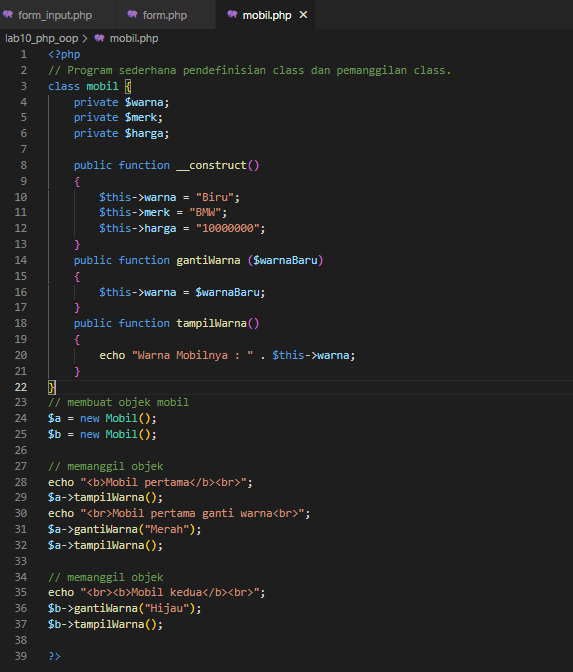
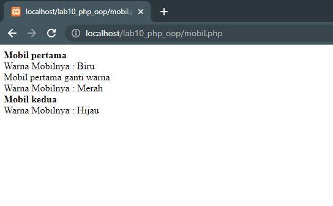
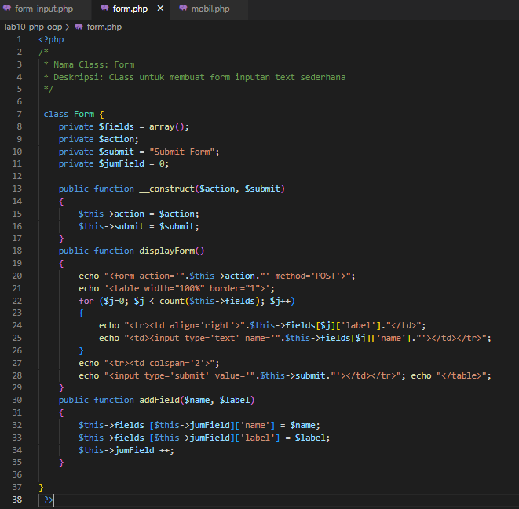
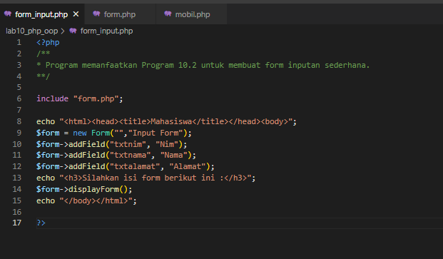
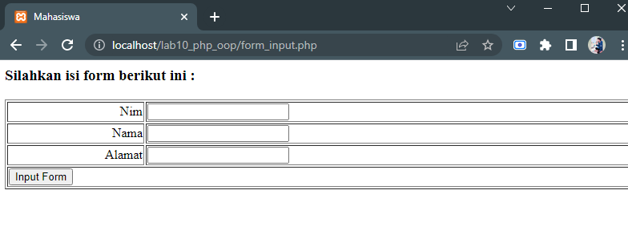

# Lab10Web
## PHP OOP
### Mobil.php
Membuat file baru dengan nama `Mobil.php` Contohnya seperti ini :

Tampilan di Web akan seperti ini :

### Form.php 
Disini kita akan membuat codingan untuk Form yaitu dengan codingan berikut ini :

### Form_input.php
Selanjutnya kita akan membuat codingan untuk display nya, yaitu dengan membuat file dengan nama `form_input.php` contohnya seperti ini :

Maka tampilan di Web akan seperti ini :

TERIMA KASIH!!!